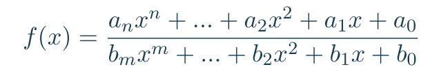
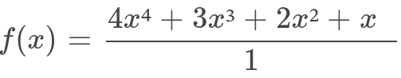

# 107transfert

A laboratory performs tests on new electronic components to be integrated into its last generation chipset.
Those components are entirely characterized by their transfer function, which determines frequency re-
sponse; this function processes the input frequency and computes an output frequency (caracterizing the
way the component amplifies or reduces the input frequency). The transfer functions of these components
are rational functions, i.e. fractions such as both the numerator and the denominator are polynomials:  

<p align="center">
  
</p>  
<br>

## Presentation

The goal of the project is to to optimize the transfer function computations and print the frequency responses of the component for a every values in a range from 0 to 1, with a step of 0.001.

```
[107transfert]$ ./107transfert -h
USAGE
    ./107transfert [num den]*
    
DESCRIPTION
   num      polynomial numerator defined by its coefficients
   den      polynomial denominator defined by its coefficients
```
## Exemples
* We want to calculate the function below:
<p align="center">
  
</p>
The numerator will be: "0 * 1 * 2 * 3 * 4"  

The denominator will be: "1"
<br>
```
[107transfert]$ ./107transfert "0*1*2*3*4" "1" > file
[107transfert]$ head -n 12 file
0.000 -> 0.00000
0.001 -> 0.00100
0.002 -> 0.00201
0.003 -> 0.00302
0.004 -> 0.00403
0.005 -> 0.00505
0.006 -> 0.00607
0.007 -> 0.00710
0.008 -> 0.00813
0.009 -> 0.00916
0.010 -> 0.01020
0.011 -> 0.01125

[107transfert]$ tail file
0.991 -> 9.73282
0.992 -> 9.76223
0.993 -> 9.79171
0.994 -> 9.82126
0.995 -> 9.85087
0.996 -> 9.88056
0.997 -> 9.91031
0.998 -> 9.94014
0.999 -> 9.97003
1.000 -> 10.00000
```
<br>

* You can manage several components in cascade. In such a case, the transfer function of the set of components is the product of the transfer functions of each component:
<p align="center">
  
</p>

Numerators will be:  "0 * 0 * 9" and "2 * 4 * 6"  
Denominators will be: "1 * 3 * 5" and "8 * 8 * 8"
<br>
```
[107transfert]$ ./107transfert "0*0*9" "1*3*5" "2*4*6" "8*8*8" > file
[107transfert]$ head file
0.000 -> 0.00000
0.001 -> 0.00000
0.002 -> 0.00001
0.003 -> 0.00002
0.004 -> 0.00004
0.005 -> 0.00006
0.006 -> 0.00008
0.007 -> 0.00011
0.008 -> 0.00014
0.009 -> 0.00018

[107transfert]$ tail file
0.991 -> 0.49599
0.992 -> 0.49643
0.993 -> 0.49688
0.994 -> 0.49733
0.995 -> 0.49777
0.996 -> 0.49822
0.997 -> 0.49867
0.998 -> 0.49911
0.999 -> 0.49956
1.000 -> 0.50000
```

--------------------
## Language

* [Python](https://en.wikipedia.org/wiki/Python_(programming_language))

--------------------
## Authors

* __Alexandre CATHALIFAUD__ - [ChoKssa](https://github.com/ChoKssa)


